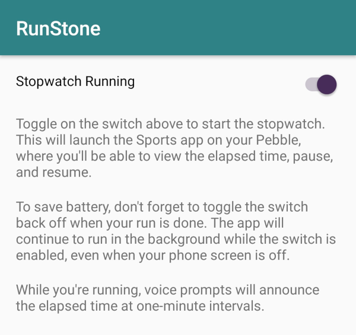

#  RunStone

> Android + Pebble app for timing my morning run

## Overview

RunStone works like a stopwatch.

During my run, it drives the built-in Sports app of my Pebble smartwatch (via the [PebbleKit Sports API](https://developer.pebble.com/guides/communication/using-the-sports-api/)), updating the "Duration" display and handling the pause/resume button.

With my headphones plugged into my phone, it also provides text-to-speech audio feedback, announcing the elapsed time at one-minute intervals.

Compared to the alternatives I tried before building this:

- **RunKeeper** demanded that I create an account so their proprietary service could suck up my data, including location information. I wasn't comfortable with this and don't actually need a historical record of my runs or analytics or whatever.
- **RunnerUp** refused to start timing without the GPS enabled and made me wait for it to get a fix on a certain number of satellites. Then it died every couple of minutes during my run, I think due to losing the GPS lock.
- **ForRunner** didn't sync to my Pebble.
- **AAT**'s interface was unintuitive and I couldn't get it to work at all. I'd start a run but the timer wouldn't budge from zero.

## Screenshot

That's all. One screen, one switch.

## License

Copyright (C) 2018 Michael Smith &lt;michael@spinda.net&gt;

This program is free software: you can redistribute it and/or modify it under
the terms of the GNU Affero General Public License as published by the Free
Software Foundation, either version 3 of the License, or (at your option) any
later version.

This program is distributed in the hope that it will be useful, but WITHOUT
ANY WARRANTY; without even the implied warranty of MERCHANTABILITY or FITNESS
FOR A PARTICULAR PURPOSE. See the GNU Affero General Public License for more
details.

You should have received a copy of the GNU Affero General Public License along
with this program. If not, see <http://www.gnu.org/licenses/>.